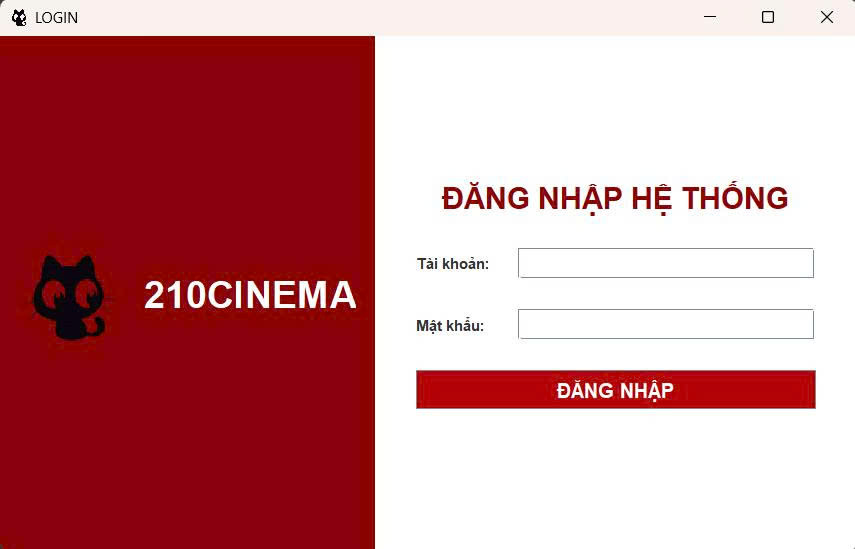
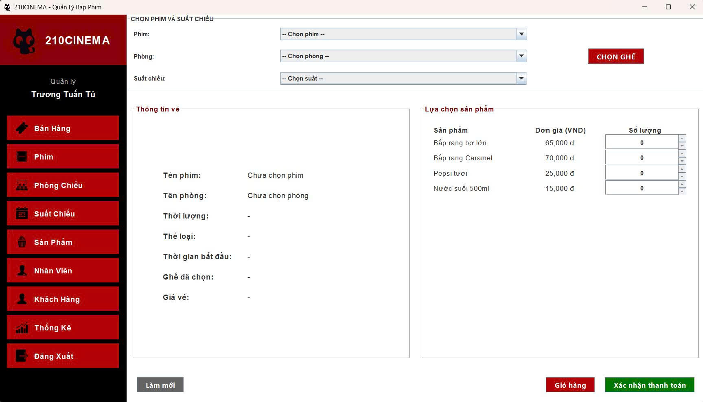

# 1. Giới thiệu đồ án: Hệ thống quản lý rạp phim
Hệ thống được xây dựng nhằm tự động hóa quy trình vận hành của một rạp chiếu phim, bao gồm:

   - Quản lý nhân viên, phim, suất chiếu, phòng chiếu và sơ đồ ghế ngồi
   - Bán vé + đồ ăn nước uống tại quầy
   - Quản lý khách hàng thành viên, tích điểm
   - Thống kê doanh thu và báo cáo chi tiết
   - Phân quyền (Admin CSDL, Quản lý - Nhân viên bán vé)
   
**Mục tiêu:** Áp dụng kiến thức Cơ sở dữ liệu để tạo ra một phần mềm ổn định, dễ sử dụng và có thể triển khai thực tế.

**Phạm vi:** Chỉ tập trung vào quy trình bán vé tại quầy và quản trị nội bộ (chưa bao gồm đặt vé online và thanh toán trực tuyến).

# 2. Yêu cầu hệ thống và cách cài đặt:
## 2.1. Phần mềm cần cài đặt
|STT|Phần mềm|Phiên bản khuyến nghị|
|---|--------|----------------------|
|1|Hệ điều hành|Windows 10/11 |
|2|Java JDK| 25 (đã test ổn định)|
|3| Microsoft SQL Server| 2022|
|4| SQL Server Management Studio(SSMS)| 20.x|
|5| IDE| Apache Netbeans|

## 2.2. Thư viện đã đóng gói sẵn
Tất cả file `.jar` cần thiết nằm trong thư mục `/src/lib/`  
→ Nếu dùng NetBeans: chạy luôn được  
→ Nếu dùng IDE khác: cần thêm toàn bộ file trong `/src/lib/` vào **Project Libraries/Classpath**

## 2.3 Lấy source code - 2 cách:**
- Cách 1 - Git clone: `git clone git@github.com:dylangk2005/210Cinema.git`
- Cách 2 - Download zip: download [tại đây](https://github.com/dylangk2005/210Cinema/archive/refs/heads/main.zip)

# 3. Huớng dẫn chạy:
- Mở SSMS → chạy file CinemaDB.sql trong source code (đã có dữ liệu mẫu)
- Mở project bằng NetBeans → Clean and Build (Shift+F11)
- Chạy dự án (Login.java): Đã set sẵn

Sau khi build xong và chạy bạn sẽ thấy giao diện đăng nhập:

Đăng nhập bằng tài khoản mẫu dưới đây:

|Vai trò|Tài khoản|Mật khẩu|
|---|--------|----------------------|
|Quản lý|tu_ql|1234567|
|Nhân viên bán vé|duc_nv|1234567|

Sau khi đăng nhập thành công thì giao diện trang chủ sẽ hiện ra: 

**Lưu ý: Nếu không chạy được:**
- Kiểm tra SQL Server Authentication đã bật
- Cổng 1433 đã mở
- Đã chạy đúng file CinemaDB.sql

